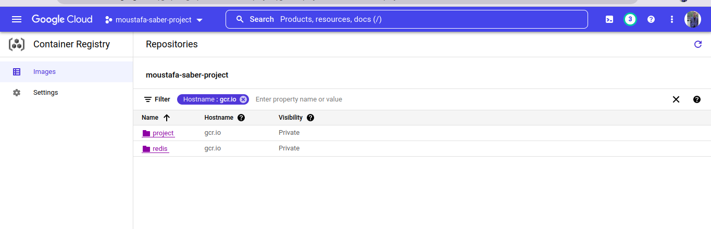
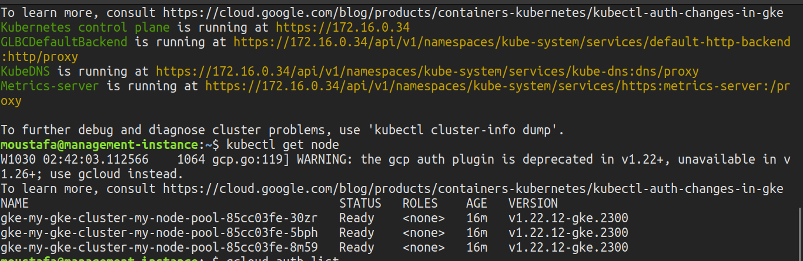
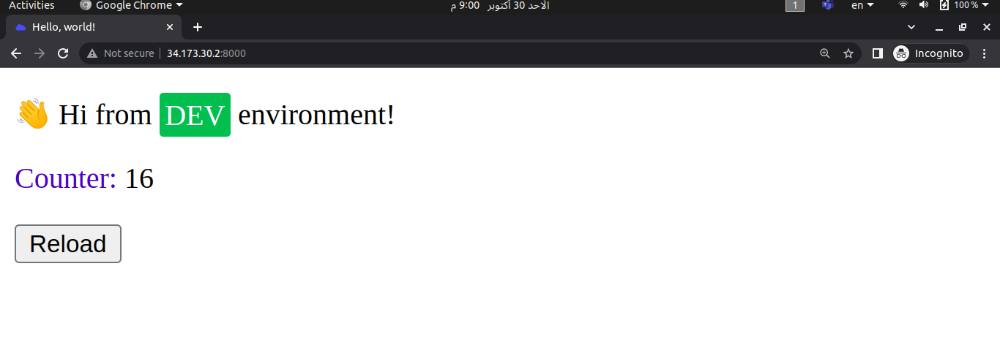

# GCP-Final-Task
Deploying Python App on GKE Created by Terraform
# Deploy Python App on GCP Using Kubernetes
## The Used Tools
 - Terraform , Docker , Kubernetes

## The Provisioned Infastructure: 

-VPC          -Two Subnets ( management Subnet - restricted Subnet )
-NAT Gateway  - Router       - Firewall Rule   - Private VM - Private GKE Cluster 

## Steps:
### 1) Apply the infrastructure Using Terraform 
```bash
$ terraform apply --var-file prod.tfvars
```


### 2) Connect to the Private VM Via SSH
```bash
$ gcloud compute ssh --zone "us-central1-a" "management-instance"  --tunnel-through-iap --project "moustafa-saber-project"
```
### 3) Connfigure the VM so it Can connect to the private GKE
```bash
$ curl -O https://dl.google.com/dl/cloudsdk/channels/rapid/downloads/google-cloud-cli-394.0.0-linux-x86_64.tar.gz
$ tar -xf google-cloud-cli-394.0.0-linux-x86_64.tar.gz
$ ./google-cloud-sdk/install.sh
$ ./google-cloud-sdk/bin/gcloud init
$ sudo apt-get install google-cloud-sdk-gke-gcloud-auth-plugin
$ sudo apt-get install kubectl
```
### 4) Dockerize the python app with its necessary dependencies 
```bash
$ docker build --tag project:python .
```
### 5) Pushing the deockerized python image with redis image into GCR as aprivate images 
```bash
$ docker pull redis
$ docker tag redis gcr.io/moustafa-saber-project/redis:latest
$ docker push gcr.io/moustafa-saber-project/redis
$ docker tag project gcr.io/moustafa-saber-project/project:python
$ docker push gcr.io/moustafa-saber-project/project:python
```


### 5) connect to the cluster
```bash
$ gcloud container clusters get-credentials my-gke-cluster --zone us-central1-a --project moustafa-saber-project
$ kubectl get nodes 
```


### 6) Deploy Python app on GKE 
```bash
$ kubectl apply -f redis.yml
$ kubectl apply -f backend-service.yml
$ kubectl apply -f project-python.yml
$ kubectl apply -f frontend-service.yml
```


### 7) checking the running app 


